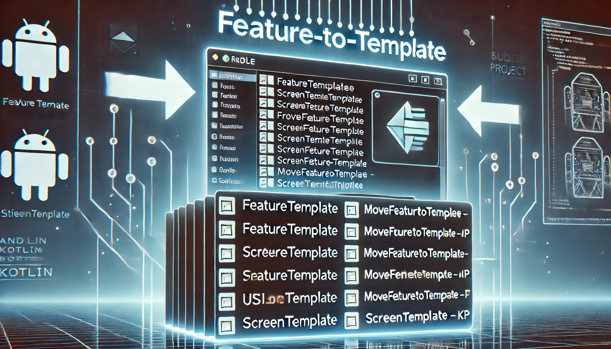

# Automate Android Feature Creation with Gradle

This project explores the power of Gradle in automating Android feature creation and template transformation. In this series, we'll dive deep into the steps required to set up a streamlined process for creating features and transforming them into reusable templates, using Gradle's scripting capabilities.

## Articles:

### Part 1: Automate Android Feature Creation with Gradle

In this first part, we discuss how to set up a Gradle-based process for automating the creation of new Android features, making it easier to add modular features to your Android projects efficiently.

🌟 What You’ll Learn:
- How to set up a Gradle task to generate feature files automatically.
- Customizing templates for feature creation with dynamic code replacements.
- Managing directory structure and organizing template files efficiently.

[Read Part 1 Here](https://medium.com/@meet26/automate-android-feature-creation-with-gradle-cfd51373e167)

https://github.com/user-attachments/assets/8793d2ad-9025-4a9b-b1da-89bb0d75e681

---

### Part 2: Automating Reverse Feature to Template Transformation in Gradle

In Part 2, we take a step further by automating the transformation of features back into templates. This allows you to create reusable feature templates that can be applied to other projects or parts of your app.

🌟 What You’ll Learn:
- Convert existing feature modules into reusable templates
- Automate file structure and code refactoring using Gradle
- Save time and maintain consistency across your project

[Read Part 2 Here](https://medium.com/@meet26/part-2-automating-reverse-feature-to-template-transformation-in-gradle-3973880bb6ff)

https://github.com/user-attachments/assets/94421bb4-6661-4785-a3cc-414ce220ce71

## Branches Example

### 1. `simple-create-feature-example`
This branch demonstrates the creation of a simple home screen feature with its essential components, such as UI state, UI event, and ViewModel. It showcases how to use Gradle to automate the process of setting up these components in an Android project.

Key topics covered:
- Creating a simple home screen feature
- Automating UI state and UI event setup
- Setting up ViewModel with Gradle tasks

[View the `simple-create-feature-example` branch](https://github.com/Coding-Meet/Screen-Module-Generator/tree/simple-create-feature-example)

---

### 2. `simple-create-template-example`
In this branch, we demonstrate the creation of a simple screen template, allowing you to quickly create reusable templates for screens, UI state, UI events, and ViewModels. Gradle tasks automate the extraction and management of templates for future use.

Key topics covered:
- Creating reusable screen templates
- Automating UI state and UI event setup in templates
- Setting up ViewModel templates

[View the `simple-create-template-example` branch](https://github.com/Coding-Meet/Screen-Module-Generator/tree/simple-create-template-example)

---

### 3. `master`
The `master` branch features a real-world example: an e-commerce product list feature. This branch demonstrates how to apply Gradle tasks to set up and customize the entire feature structure for practical use cases. It is a fully functional example of feature automation that can be adapted to other Android apps.

Key topics covered:
- Full e-commerce product list feature setup
- Customizing feature structure with Gradle tasks
- Practical use cases for automated feature creation

[View the `master` branch](https://github.com/Coding-Meet/Screen-Module-Generator/tree/master)

## [check out all my Medium article here](https://medium.com/@meet26)

## ❤ Show your support

Give a ⭐️ if this project helped you!

Your generosity is greatly appreciated! Thank you for supporting this project.

## Connect with me

## Author

**Meet**
